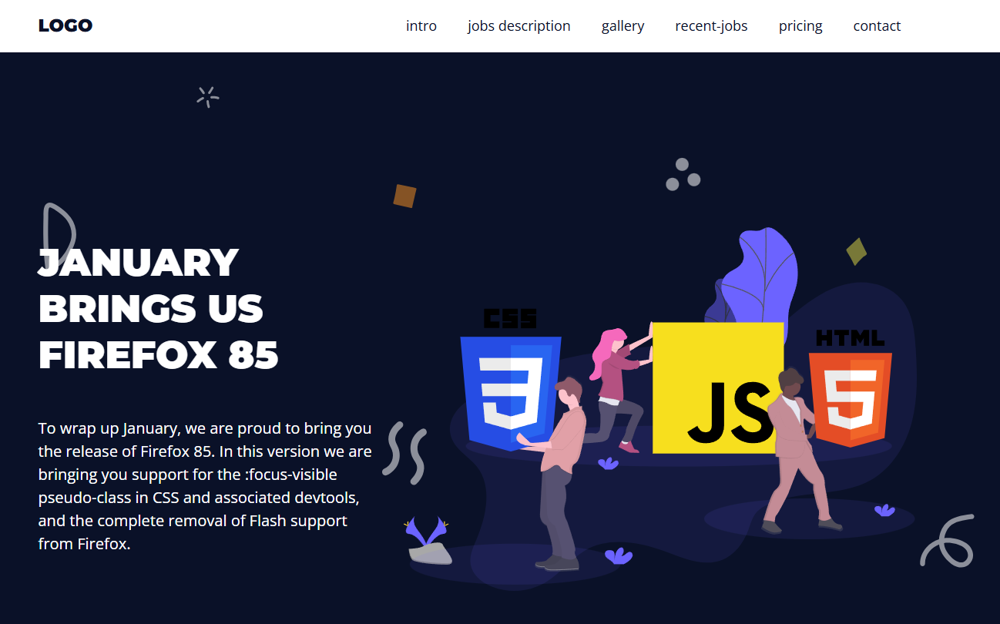
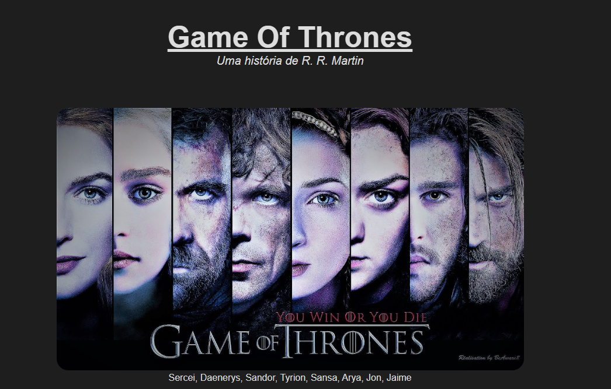
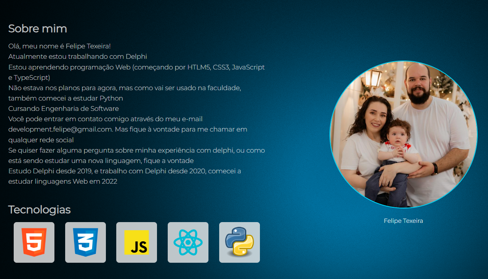

# 💼 Portfólio de Projetos – Felipe Teixeira

[](#)
[](#)
[](#)
[](#)
[](#)
[](#)

Bem-vindo ao meu portfólio! Aqui estão alguns dos projetos que desenvolvi com foco em interfaces web modernas, responsivas e bem estruturadas.

---

## 🚀 Projetos em Destaque

### 📌 Landing Page JavaScript



🔗 **Acesse**: [landingpagejavascript.netlify.app](https://landingpagejavascript.netlify.app/)

> Landing page responsiva com animações e foco em UI/UX utilizando HTML, CSS e JavaScript.

---

### 📌 Tributo Game of Thrones



🔗 **Acesse**: [tributogot.netlify.app](https://tributogot.netlify.app/)

> Página tributo desenvolvida para praticar semântica HTML e estilização CSS com foco visual.

---

### 📌 Tributo Game of Thrones



🔗 **Acesse**: [devfelipe.netlify.app](https://devfelipe.netlify.app/)

> Página criada para contar um pouco sobre quem sou profissionalmente

---

## 🛠️ Tecnologias & Ferramentas

- HTML5, CSS3, JavaScript ES6+
- Node.js & TypeScript
- Python (estudos atuais)
- Git & GitHub
- VS Code
- Figma

---

## 👨‍💻 Sobre Mim

Sou desenvolvedor apaixonado por tecnologia e boas práticas de código. Tenho focado em projetos web para consolidar habilidades e me manter atualizado com as tendências de mercado.

- 🎓 Engenharia de Software (em andamento)
- 📍 Santa Catarina, Brasil
- 🔗 [LinkedIn](https://www.linkedin.com/in/felipe-teixeira-460464110/)
- 🔗 [GitHub](https://github.com/DevWebFelipe)
- 🌐 [Sobre mim](https://devfelipe.netlify.app/)

---

## 🧪 Como Rodar os Projetos Localmente

```bash
git clone https://github.com/DevWebFelipe/portfolio
```

📬 Entre em contato para feedbacks, dúvidas ou colaborações:

- 📧 felipe.flptxr@gmail.com
- 📱 (48) 99841-2807
